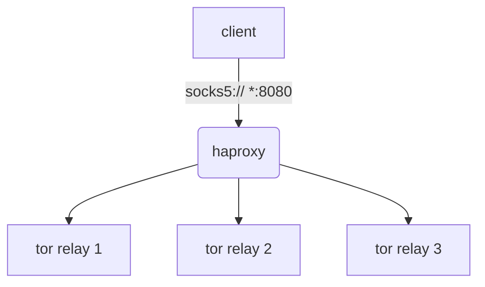

# multisocks

a simple load balanced torsocks service, a fork of the excellent [Iglesys347/castor](https://github.com/Iglesys347/castor)

creates a defined number of backend tor circuits, leveraging haproxy to round-robin requests

tl;dr - one ingress proxy, infinite exit circuits



---

## configuration

set the number of tor instances to be created by altering `SOCKS` within `.env`

alternativley see `services.tor.deploy.replicas` within `docker-compose.yml`
## runtime

```shell
git clone https://github.com/joshhighet/multisocks
docker compose --file multisocks/docker-compose.yml up --detach
```

## debugging

```shell
cd multisocks
docker compose logs --timestamps --follow
```

_for further tracing, modify `Log` within `tor/torrc` or enable the `ControlPort` and leverage [nyx](https://nyx.torproject.org)_

## testing

```shell
for i in {1..10}
    curl -sLx socks5://localhost:8080 cloudflare.com/cdn-cgi/trace \
    | grep -Po '\b([0-9]{1,3}\.){3}[0-9]{1,3}\b'
done
```

