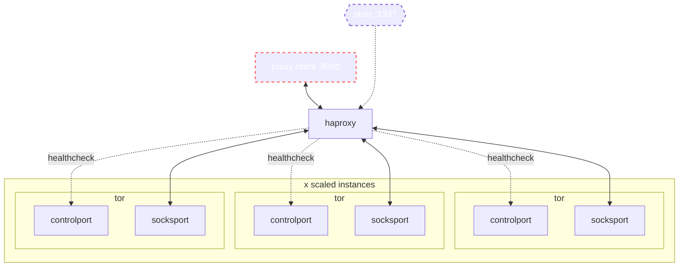
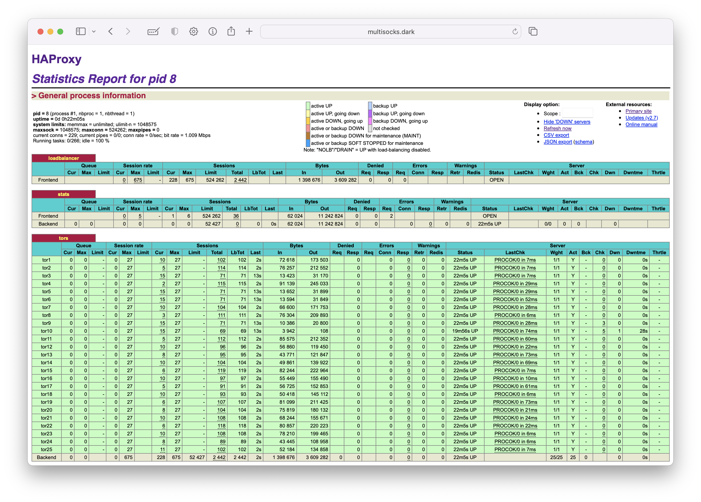

# multisocks

multisocks is a tool for running frameworks such as spiders or scanners against infrastructure (onion services) on the tor network

it is a tcp load balanced SOCKS5 proxy that can speed up other tools by spawning up to 4095 tor circuits of which inbound requests can be distributed across

it can significantly cut-down load times for correctly scaled applications by doing the following

- creating a very large number of tor circuits
- surfacing a single-ingress SOCKS5 proxy
- adequately load-balance backend connections
- performing health-checks against each backend tor circuit
- serving a load balancer monitoring dashboard

_multisocks is a fork/derivative of the excellent [Iglesys347/castor](https://github.com/Iglesys347/castor)_

multisocks exposes a SOCKS5 proxy on `:8080` and a statistics report on `:1337` by default.



---

## configuration

if you do not define a number of Tor instances (ref `backends`) - it will default to 5. on 2x2 (`cpu`/`memory`) machine this can comfortably run 50 circuits.

avoid defining more than `4095` backends - this is a haproxy limitation. to work around this, create a secondary backend group - do so referencing `backend tors` within [haproxy.j2](haconfig/haproxy.j2) and update the configuration template [haproxy.j2](haconfig/haproxy.j2) accordingly.

set the number of tor instances to be created by altering `SOCKS` within `.env`

_reference `services.tor.deploy.replicas` within `docker-compose.yml`_
## runtime

```shell
git clone https://github.com/joshhighet/multisocks
# add --detach at the end of the below command detatch the command from your existing session
docker compose --file multisocks/docker-compose.yml up
```

## stats & obserability

to view the status of haproxy, navigate to `your-multisocks-host:1337` in a browser. you should see the number of backends as defined in `.env` along with other useful metrics



to fetch state of each circuit you could leverage something similar to the below

```shell
watch -n 5 "curl -s 'http://localhost:1337/;csv' \
| awk -F ',' '{print \$2 \" - \" \$18}' \
| grep -v 'status\|FRONT\|BACK'"
```

## debugging

to trail logs, leverage `docker compose logs`

```shell
cd multisocks
docker compose logs --timestamps --follow
```

to enter a shell in a running container, use `docker exec`.

to view your container names use `docker ps ` - replace `multisocks-haproxy` accordingly

```shell
docker exec -it -u root multisocks-haproxy ash
```

## testing

this is a short script to check multisocks is running correctly. 

> it assumes multisocks is running locally and makes ten requests to Cloudflare, returning the requested IP for each request

```shell
for i in {1..10}; do
    curl -sLx socks5://localhost:8080 cloudflare.com/cdn-cgi/trace | grep ip\=
done
```

to test against hsdir resolutions, simply replace the cloudflare URL with an onion service

> to find some online onion services, go browse around or use the below for starters

```shell
curl -sL ransomwhat.telemetry.ltd/groups \
| jq -r '.[].locations[] | select(.available==true) | .slug' \
| head -n 10
```

## notes

the current health-check implementation leaves much room for improvement. it uses netcat to send an _authenticated_ telnet command `getinfo circuit-status`. an alternate could be to use stem, with something like the below

```python
import stem.control
def is_circuit_built():
    with stem.control.Controller.from_port(port=9051) as controller:
        controller.authenticate()
        circs = controller.get_circuits()
        for circ in circs:
            if circ.status == 'BUILT':
                return True
        return False
```