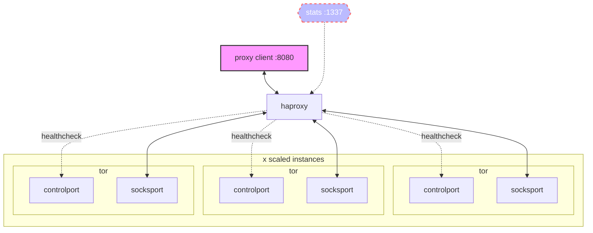

# multisocks

multisocks is a tool for running frameworks such as spiders or scanners against innfrastructure on the tor network (onion services).

it can significantly cut-down load times for correctly scaled applications by doing the following

- creating an infinite number of tor circuits
- surfacing a single-ingress SOCKS5 proxy
- adequatley load-balance backend connections
- performing health-checks against each backend tor cirtuit
- serving a load balancer monitoring dashboard

_multisocks is a fork/derivative of the excellent [Iglesys347/castor](https://github.com/Iglesys347/castor)_

multisocks will expose a SOCKS5 proxy on `:8080` and a statistics report on `:1337`



---

## configuration

if you do not define a number of Tor instances (ref `backends`) - it will default to 5. on 2x2 (`cpu`/`memory`) machine this can comfortably run 50 circuits.

avoid defining more than `4095` backends - this is a haproxy limitation. to work around this, create a secondary backend group - do so referencing `backend tors` within [haproxy.j2](haconfig/haproxy.j2) and update the configuration template [haproxy.j2](haconfig/haproxy.j2) accordingly.

set the number of tor instances to be created by altering `SOCKS` within `.env`

_reference `services.tor.deploy.replicas` within `docker-compose.yml`_
## runtime

```shell
git clone https://github.com/joshhighet/multisocks
docker compose --file multisocks/docker-compose.yml up --detach
```

## stats & obserability

to view the status of haproxy, navigate to `your-multisocks-host:1337` in a browser. you should see the number of backends as defined in `.env` along with other useful metrics


## debugging

```shell
cd multisocks
docker compose logs --timestamps --follow
```

## testing

```shell
for i in {1..10}
    curl -sLx socks5://localhost:8080 cloudflare.com/cdn-cgi/trace \
    | grep -Po '\b([0-9]{1,3}\.){3}[0-9]{1,3}\b'
done
```

