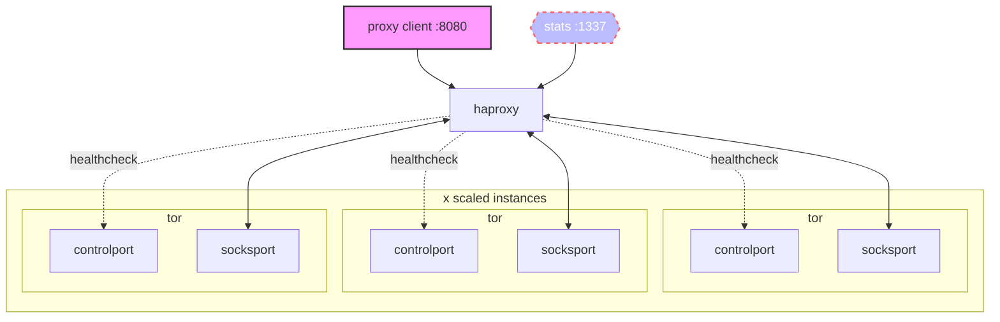

# multisocks

a simple load balanced torsocks service, a fork of the excellent [Iglesys347/castor](https://github.com/Iglesys347/castor)

creates an infinite number of backend tor circuits, leveraging haproxy to round-robin requests

multisocks will expose a SOCKS5 proxy on `:8080` and a statistics report on `:1337`



---

## configuration

set the number of tor instances to be created by altering `SOCKS` within `.env`

_reference `services.tor.deploy.replicas` within `docker-compose.yml`_
## runtime

```shell
git clone https://github.com/joshhighet/multisocks
docker compose --file multisocks/docker-compose.yml up --detach
```

after bringing up the containerset - you will need to wait for tor to build circuits before the proxy will accept connections

## stats & obserability

to view the status of haproxy, navigate to `your-multisocks-host:1337` in a browser. you should see the number of backends as defined in `.env` along with other useful metrics


## debugging

```shell
cd multisocks
docker compose logs --timestamps --follow
```

## testing

```shell
for i in {1..10}
    curl -sLx socks5://localhost:8080 cloudflare.com/cdn-cgi/trace \
    | grep -Po '\b([0-9]{1,3}\.){3}[0-9]{1,3}\b'
done
```

